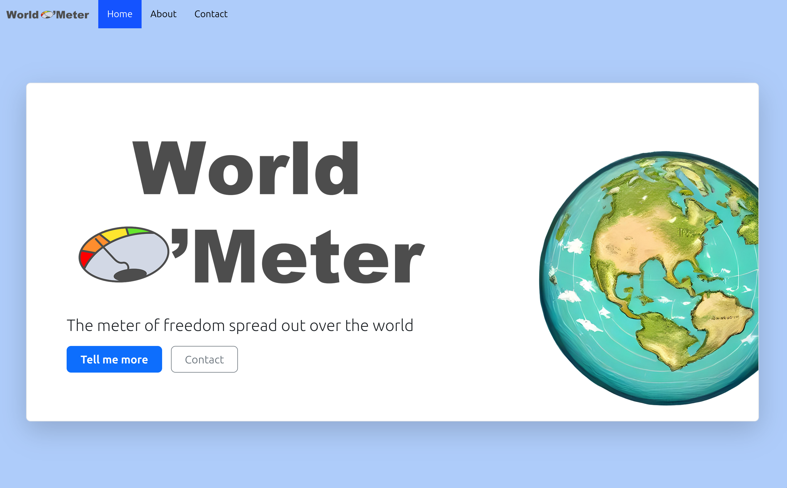

# 🌐 World-o-meter

  
**Version:** 1.0.0  
**Motivation:** Computational Social Science at the University of Amsterdam  

---

## 🎯 Overview

**World-o-meter** is a web application showcasing a **relational database** that analyzes the relationship between the number of **headquarters of surveillance companies** in a country and its **freedom score**.  

The idea is to explore whether:
- More surveillance companies are located in **freer countries**, or if the correlation is different.
- Global distributions reveal patterns of surveillance in relation to political freedom.

💡 **Note:** With only **528 companies** spread across **45 countries**, the sample size is limited, but the exploration is valuable and may still yield interesting insights.

---

## 📊 Data Sources

- **Freedom in the World Data** → Provided by [Freedom House](https://freedomhouse.org/report/freedom-world).  
- **Surveillance Industry Index** → A list of surveillance companies and their headquarters.  
- **City-to-Country Data** → Provided by [SimpleMaps](https://simplemaps.com/data/world-cities).  

---

## 🔄 Data Conversion

To convert raw data into SQL, I used [SQLizer](https://sqlizer.io/).  
This greatly simplified the process of compiling data into a relational database format.  
*Since the data is not sensitive, this method was appropriate and efficient.*  

---

## 📜 License

This project is licensed under the MIT License – see the LICENSE file for details.

---
